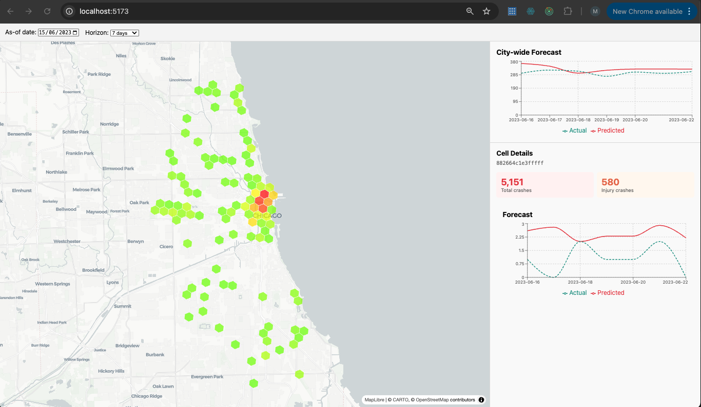

# CrashScope

A forecasting and decision-support app built on 776,000+ Chicago traffic crashes (2016-2023). Pick any historical date, forecast the next N days, and compare predictions against what actually happened.



## Architecture

```
Traffic_Crashes.csv
        │
        ▼
  ┌─────────────┐     ┌──────────────┐     ┌──────────────┐
  │   Ingest     │────▶│   Features   │────▶│   H3 Index   │
  │  (clean,     │     │ (wet weather,│     │ (lat/lon →   │
  │   filter)    │     │  time, speed)│     │  hex cells)  │
  └─────────────┘     └──────────────┘     └──────────────┘
                                                   │
                              ┌─────────────────────┤
                              ▼                     ▼
                    ┌──────────────┐      ┌──────────────┐
                    │  City Panel  │      │  Cell Panel   │
                    │ (1 row/day,  │      │ (1 row/day/  │
                    │  city totals)│      │  H3 cell)    │
                    └──────┬───────┘      └──────┬───────┘
                           │                     │
                           ▼                     ▼
                    ┌──────────────┐      ┌──────────────┐
                    │  City Model  │      │  Cell Model  │
                    │  (LightGBM)  │      │  (LightGBM)  │
                    └──────┬───────┘      └──────┬───────┘
                           │                     │
                           ▼                     ▼
                    ┌────────────────────────────────────┐
                    │          FastAPI Service            │
                    │  /forecast/city  /hotspot/{cell}   │
                    │  /hotspots/top   /health           │
                    └──────────────┬─────────────────────┘
                                  │
                                  ▼
                    ┌────────────────────────────────────┐
                    │        React Frontend              │
                    │  deck.gl H3 map + Recharts         │
                    │  date picker + hotspot drill-down  │
                    └────────────────────────────────────┘
```

### Data Flow Trace

A typical request: user picks `as_of_date=2022-06-15`, `horizon=7`

1. **Frontend** calls `GET /forecast/city?as_of_date=2022-06-15&horizon=7`
2. **API** slices city panel to rows `<= 2022-06-15`
3. **City model** takes the last row's features (lag_1, lag_7, rolling_7_mean, day_of_week, etc.)
4. **Recursive predict**: for each of 7 days, advance calendar features, update lags from prior predictions, predict next day's crash count
5. **Actuals lookup**: API fetches real crash counts from 2022-06-16 through 2022-06-22
6. **Response**: `[{date, predicted_value, actual_value}, ...]`
7. **Chart**: renders predicted (red) vs actual (green dashed) lines

## Setup

```bash
cd .worktrees/crashscope   # or wherever the project lives

# 1. Install dependencies
make install                # creates venv + installs deps
cd frontend && npm install && cd ..

# 2. Symlink the data (if needed)
ln -s /path/to/Traffic_Crashes.csv Traffic_Crashes.csv

# 3. Build data + train
make data                   # ~1 min — creates data/*.parquet
make train                  # ~30s — trains cell + city LightGBM models

# 4. Run
make serve                  # API on http://localhost:8000
cd frontend && npm run dev  # Frontend on http://localhost:5173
```

## API Endpoints

| Endpoint | Description |
|----------|-------------|
| `GET /forecast/city?horizon=7&as_of_date=2022-06-15` | City-wide daily forecast with actuals |
| `GET /hotspot/{h3_cell}?horizon=7&as_of_date=2022-06-15` | Per-cell forecast with actuals |
| `GET /hotspots/top?n=20` | Top N cells by total crash count |
| `GET /health` | Health check |

## Models

Two LightGBM regressors, both trained on 2016-2022 data (2023 held out for hindcast evaluation):

| Model | Target | Training rows | Features |
|-------|--------|---------------|----------|
| City-level (`lgbm_city_v1.txt`) | Daily city-wide crash count | ~2,500 | Calendar (day_of_week, month, is_weekend, day_of_year) + lag (1,7,14,28 day) + rolling (7,14,28 day mean/sum) |
| Cell-level (`lgbm_cell_v1.txt`) | Daily per-H3-cell crash count | ~2.2M | Same feature set, per cell |

**Recursive forecasting:** Each step advances calendar features and feeds the prediction back into lag/rolling features for the next step.

## Tests

```bash
make test    # 49 tests, ~3s
```

| Module | Tests | What's covered |
|--------|-------|----------------|
| `test_ingest.py` | 5 | CSV loading, year filtering, null handling |
| `test_features.py` | 4 | Binary flags, time periods, speed categories |
| `test_h3_index.py` | 4 | H3 cell assignment, bounds checking, null coords |
| `test_panel.py` | 8 | Zero-filling, lags, rolling features, city panel aggregation |
| `test_lgbm.py` | 6 | Fit, predict shape, non-negative, save/load, horizon variation |
| `test_naive.py` | 3 | Seasonal naive, moving average baselines |
| `test_evaluate.py` | 5 | MAE, RMSE, WAPE, rolling backtest |
| `test_api.py` | 9 | All endpoints, as_of_date, 404s, actuals |
| `test_schemas.py` | 3 | Pydantic serialization |
| `test_settings.py` | 2 | Config defaults |

## Project Structure

```
src/
  ingest.py          # CSV loading + cleaning
  features.py        # Feature engineering (flags, categories)
  h3_index.py        # H3 spatial indexing
  panel.py           # Daily panel builder (cell + city level)
  pipeline.py        # End-to-end orchestrator
  models/
    naive.py         # Baseline models (seasonal naive, moving average)
    lgbm.py          # LightGBM forecaster with recursive predict
    evaluate.py      # MAE, RMSE, WAPE, rolling backtest
  api/
    app.py           # FastAPI factory with lifespan loader
    routes.py        # Endpoint handlers
    schemas.py       # Pydantic request/response models
    deps.py          # Dependency injection
config/
  settings.py        # Pydantic settings (paths, params, API config)
frontend/
  src/
    components/      # Map, Filters, ForecastChart, HotspotPanel
    api/client.ts    # Typed fetch wrapper
    types/api.ts     # TypeScript interfaces
tests/               # 49 tests across 10 modules
```

## Data

[Chicago Traffic Crashes](https://data.cityofchicago.org/Transportation/Traffic-Crashes-Crashes/85ca-t3if) — 785,000+ crash records from the City of Chicago open data portal.

## Original Analysis

The original statistical analysis (`run_analysis.py`) is preserved in the repo. It generates 11 charts, 2 interactive maps, and a 24-slide PowerPoint covering temporal patterns, weather-severity relationships, hit-and-run analysis, and geographic hotspots. See `answerslogic.md` for detailed methodology.
